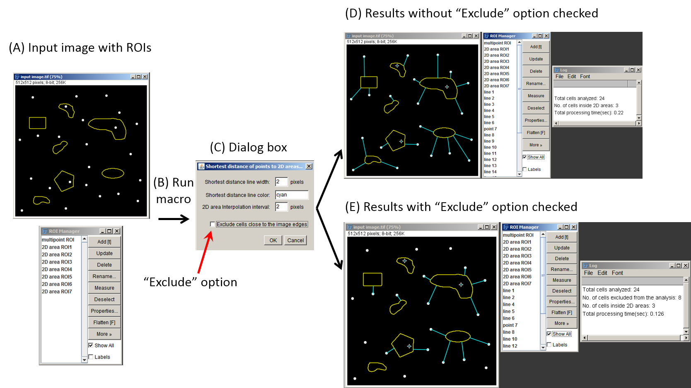

# Shortest distance between point ROIs and 2D area ROIs

#### <a href="https://github.com/ved-sharma/Shortest_distance_between_objects/blob/a3988020a3cd070b212eb6c99545ef23601b0a0d/data/Shortest_distance%20points%20to%20areas_v04d.ijm" download>Download macro<a/>

### Object 1 = a set of points (multipoints), Object 2 = 2D areas

Following image shows points selected with a multipoint tool in ImageJ and added as the 1st entry in the ROI Manager.

2D area ROIs are shown in yellow and added individually in the ROI Manager.

Goal is to find the shortest distance of each point to the nearest 2D area.

