# ImageJ/Fiji macros for measuring shortest distance between two sets of objects in 2D  
**Use case:** Following immunofluorescence image from [publication](https://www.nature.com/articles/s41467-021-27308-2) shows mouse mammary tumor section with stem cells identified with a stem cells reporter (left image, white) and DAPI-stained nuclei (right image, white). The adjacent tissue section was stained for the blood vessel intravasation sites called TMEM (Tumor MicroEnvironment of Metastasis), from where TMEM ROIs (yellow) were transferred on the fluorescence images and then the shortest distance macro was run to calculate the shortest distance of stem cells and nuclei to the nearest TMEM (cyan lines).  

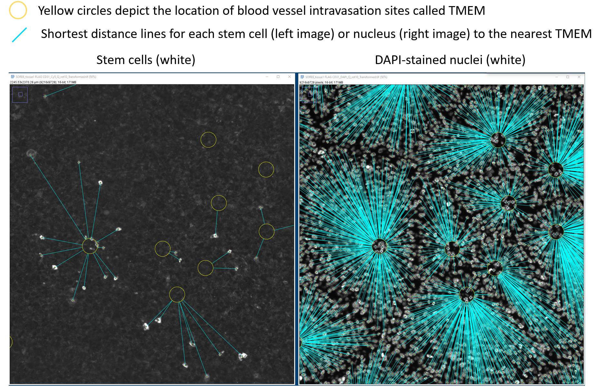

A variety of open-source (e.g. QuPath) and commerical (e.g. Imaris) image analysis softwares implement ways to measure the shortest distance between two sets of objects. 

This functionality was missing (as far as I know when I wrote these macros in 2018!) in ImageJ/Fiji, one of the most popular image analayis software used by the biological sciences community.   

Therefore, I wrote a series of four ImageJ/Fiji macros to measure shortest distances between two sets of objects:

## Case 1: Point ROIs to 2D ROIs  
#### <a href="https://github.com/ved-sharma/Shortest_distance_between_objects/blob/a3988020a3cd070b212eb6c99545ef23601b0a0d/data/Shortest_distance%20points%20to%20areas_v04d.ijm" download>Download macro<a/>

Object 1 = a set of points (multipoints), Object 2 = 2D areas

Following image shows points selected with a multipoint tool in ImageJ and added as the 1st entry in the ROI Manager.

2D area ROIs are shown in yellow in the image and added individually in the ROI Manager.

Goal is to find the shortest distance of each point to the nearest 2D area.

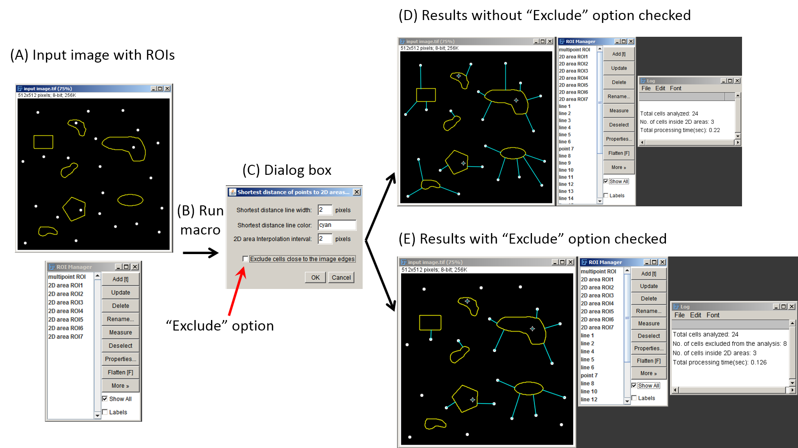

## Case 2: Point ROIs to line ROIs  
#### <a href="https://github.com/ved-sharma/Shortest_distance_between_objects/blob/18edeefa2a9812b590492c58d3df162bfc17f1d3/data/Shortest_distance%20points%20to%20lines_v01b.ijm" download>Download macro<a/> 

Input image has a set of points (multipoints in white) as object 1 and a line ROI (in yellow) as object 2, added to the ROI Manager  

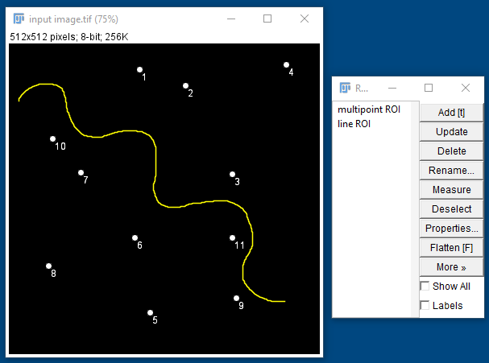

After running the macro, you get the shortest distance (shown in cyan) of each of the points to the line ROI.  

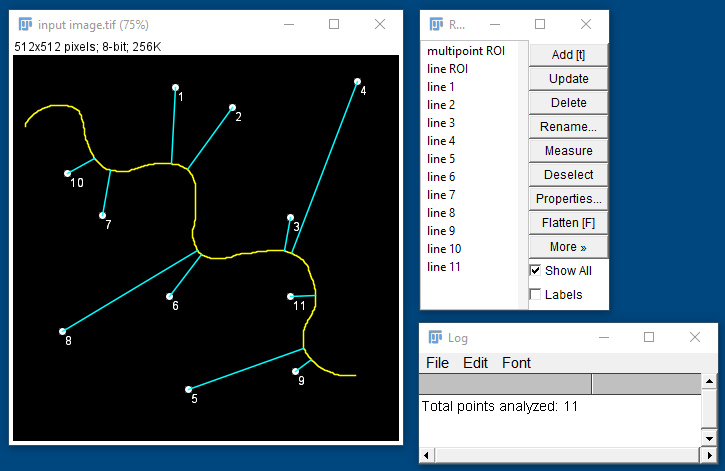

Similar to case 1, this macro can also be run with the "Exclude" option to exclude all the points close to the image boundary for which the shortest distance can not be determined.  

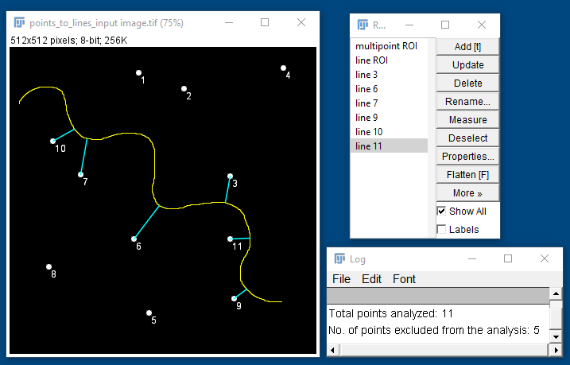

## Case 3: Point ROIs to point ROIs  
#### <a href="https://github.com/ved-sharma/Shortest_distance_between_objects/blob/b85ff5343963e2bb42f489bd06e1d0ac7d65a37d/data/Shortest_distance%20points%20to%20points_v01b.ijm" download>Download macro<a/> 

Input image has a set of points (multipoint ROI in white) as set 1 and another set of points (multipoint ROI in yellow) as set 2, added to the ROI Manager  

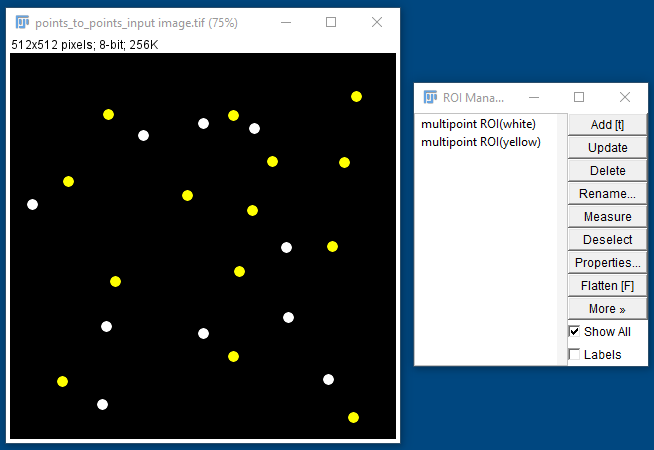

After running the macro, you get the shortest distance (shown in cyan) of each point in set 1 with the points in set 2. 

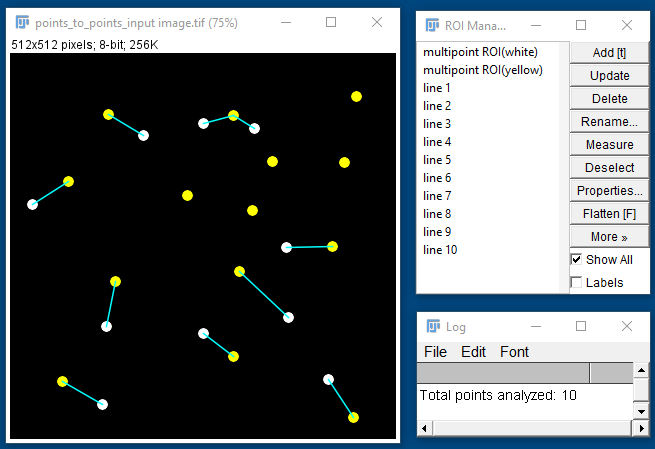

Similar to cases 1 and 2, this macro can also be run with the "Exclude" option to exclude all the points in set 1 which are close to the image boundary and the shortest distance can not be determined for them.  

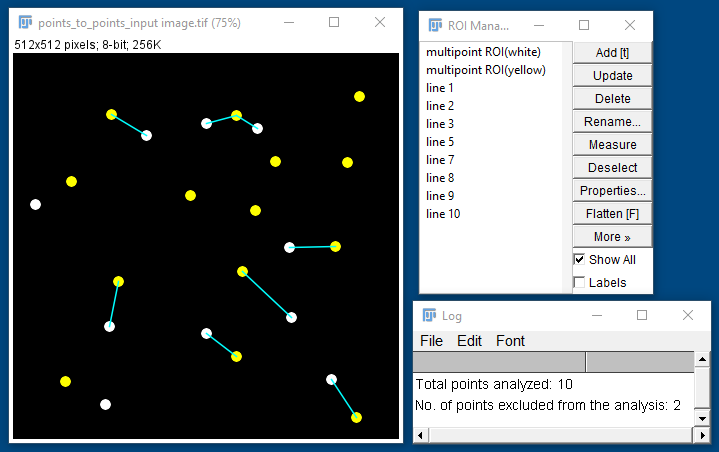

## Case 4: 2D ROIs to 2D ROIs  
#### <a href="https://github.com/ved-sharma/Shortest_distance_between_objects/blob/f444d3713505478254fc0fdf5471539af0b22664/data/Shortest_distance%20between%202D%20objects_v03.ijm" download>Download macro<a/> 

Object 1 = a set of 2D areas (ROI set 1, white), Object 2 = another set of 2D areas (ROI set 2, yellow)  

If there are multiple ROIs in each set, they need to be combined to create a [composite ROI](https://imagej.nih.gov/ij/docs/guide/146-10.html#sub:Composite-selections)  
To create a composite ROI, select all the ROIs in the ROI manager and click on ***More >> OR (Combine)*** and then press **t** to add the composite ROI to the end of the ROI list. Delete all the individual ROIs.  

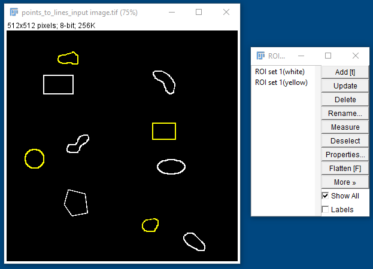

After running the macro, you get the shortest distance (shown in cyan) of each 2D area in set 1 with the 2D areas in set 2. 

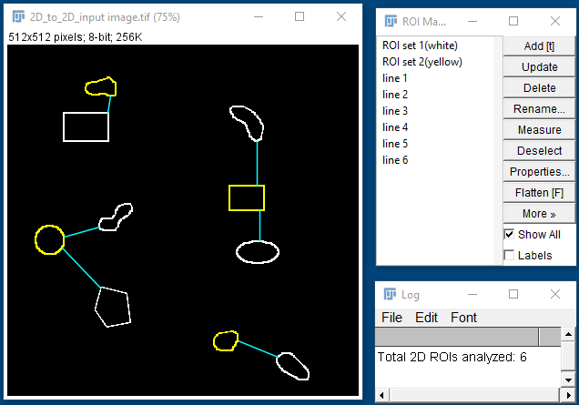

Similar to other cases, this macro can also be run with the "Exclude" option to exclude all the 2D areas in set 1 which are close to the image boundary and the shortest distance can not be determined for them.  

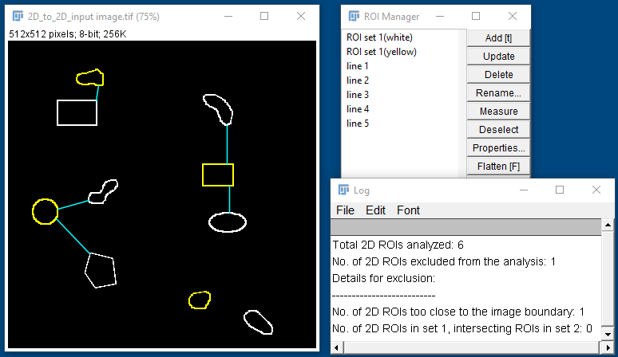

# How to cite
Sharma VP, Tang B, Wang Y, Duran CL, Karagiannis GS, Xue EA, Entenberg D, Borriello L, Coste A, Eddy RJ, Kim G, Ye X, Jones JG, Grunblatt E, Agi N, Roy S, Bandyopadhyaya G, Adler E, Surve CR, Esposito D, Goswami S, Segall JE, Guo W, Condeelis JS, Wakefield LM, Oktay MH. Live tumor imaging shows macrophage induction and TMEM-mediated enrichment of cancer stem cells during metastatic dissemination. Nat Commun. 2021 Dec 15;12(1):7300. doi: 10.1038/s41467-021-27308-2. PMID: 34911937; PMCID: PMC8674234.

# Questions
[Image.sc](https://forum.image.sc/) is the best place to ask questions about these macros. Please post your question with the @vedsharma tag so I get the notification..
